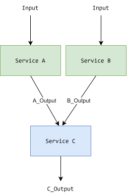

In this article, we will solve the following programming exercise in GO:

> Call 3 Webservices asynchronously using go routines

Here are the services:

```go
type Input struct{}
type A_Output struct{}
type B_Output struct{}
type C_Output struct{}

func ServiceA(i Input) (A_Output, error) {
	// simulate a real service call
	<-time.After(30 * time.Millisecond)
	return A_Output{}, nil
}
func ServiceB(i Input) (B_Output, error) {
	// simulate a real service call
	<-time.After(1 * time.Millisecond)
	return B_Output{}, nil
}
func ServiceC(a A_Output, b B_Output) (C_Output, error) {
	// simulate a real service call
	<-time.After(10 * time.Millisecond)
	return C_Output{}, errors.New("ERROR C")
}
```

## Dependency analysis

The first step is to analyze dependencies to identify which service can run concurrently. Since A and B are independent from each other, they can be called at the same time. Service C, on the other, depends on both the output of A and B and therefore has to be called after they have run. This is summarized in the figure below.



## Video Solution

The full video walkthrough is available on youtube:



## Full Solution

```go

package main

import (
	"context"
	"errors"
	"fmt"
	"time"
)

type Input struct{}
type A_Output struct{}
type B_Output struct{}
type C_Output struct{}

func ServiceA(i Input) (A_Output, error) {
	// simulate a real service call
	println("ServiceA is running")
	<-time.After(30 * time.Millisecond)
	println("ServiceA is done")
	return A_Output{}, nil
}
func ServiceB(i Input) (B_Output, error) {
	// simulate a real service call
	println("ServiceB is running")
	<-time.After(1 * time.Millisecond)
	println("ServiceB is done")
	return B_Output{}, nil
}
func ServiceC(a A_Output, b B_Output) (C_Output, error) {
	// simulate a real service call
	println("ServiceC is running")
	<-time.After(10 * time.Millisecond)
	println("ServiceC is done")
	return C_Output{}, errors.New("ERROR C")
}

func CallServices(i Input, timeout time.Duration) (C_Output, error) {
	ctx, cancel := context.WithTimeout(
		context.Background(),
		timeout,
	)
	defer cancel()

	a_out := make(chan A_Output, 1)
	e_out := make(chan error, 2)

	go func() {
		defer close(a_out)
		a, ok := ServiceA(i)
		if ok != nil {
			e_out <- ok
			println("Got an error from serviceA")
			return
		}
		a_out <- a
	}()

	b_out := make(chan B_Output, 1)
	go func() {
		defer close(b_out)
		b, ok := ServiceB(i)
		if ok != nil {
			e_out <- ok
			println("Got an error from serviceB")
			return
		}
		b_out <- b
	}()

	var a A_Output
	var b B_Output
	for _ = range 2 {
		select {
		case a = <-a_out:
			println("Received value from a_out channel")
			a_out = nil

		case b = <-b_out:
			println("Received value from b_out channel")
			b_out = nil

		case <-e_out:
			println("Received error from e_out (ServiceA or ServiceB)")
			return C_Output{}, errors.New("ERROR")

		case <-ctx.Done():
			println("Received Timeout (ServiceA or ServiceB)")
			return C_Output{}, errors.New("TIMEOUT")
		}
	}

	c_out := make(chan C_Output, 1)
	go func() {
		defer close(c_out)
		c, ok := ServiceC(a, b)
		if ok != nil {
			e_out <- ok
			println("Got an error from serviceC")
			return
		}
		c_out <- c
	}()

	var c C_Output
	select {
	case c = <-c_out:
		println("Received value from c_out channel")
	case <-e_out:
		println("Received error from e_out channel (ServiceC)")
		return C_Output{}, errors.New("ERROR from C")
	case <-ctx.Done():
		println("Received Timeout from context (ServiceC)")
		return C_Output{}, errors.New("Timeout ServiceC")
	}
	return c, nil
}

func main() {
	i := Input{}
	c, ok := CallServices(i, 50*time.Millisecond)
	if ok != nil {
		println("There was an error:", ok.Error())
		return
	}

	fmt.Printf("All Done! %v", c)
}
```