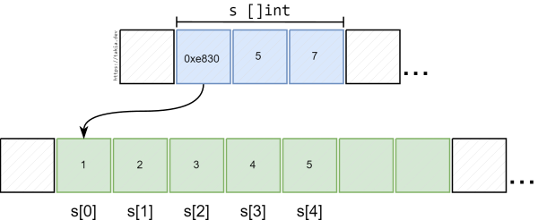
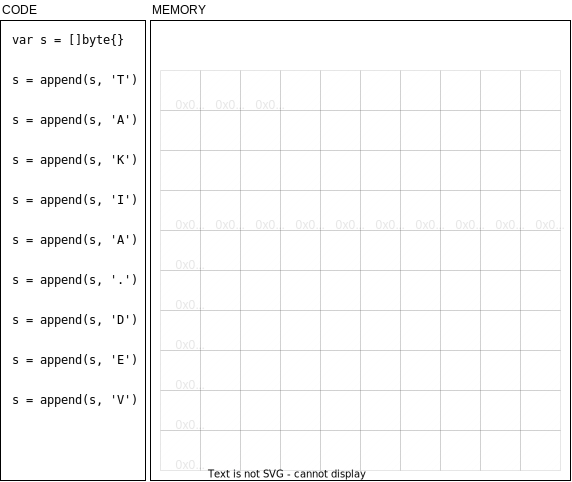
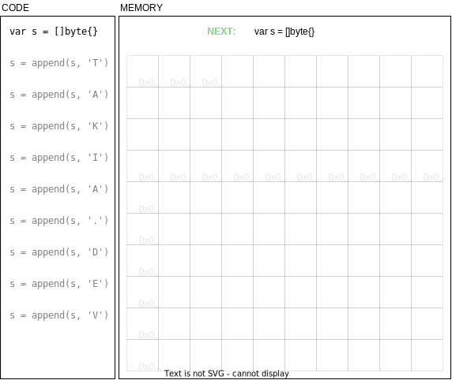
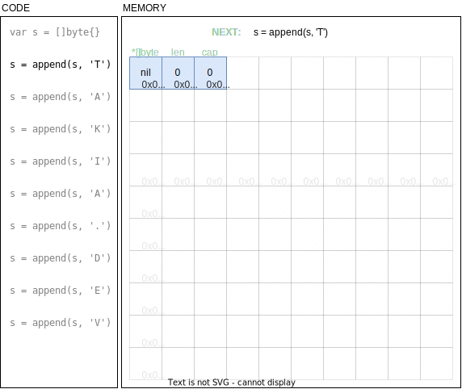
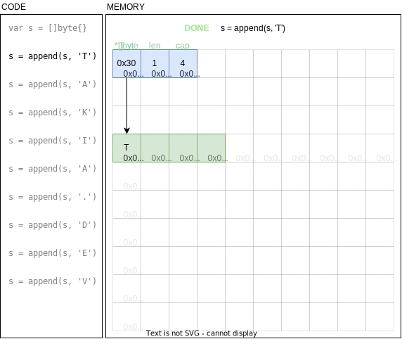
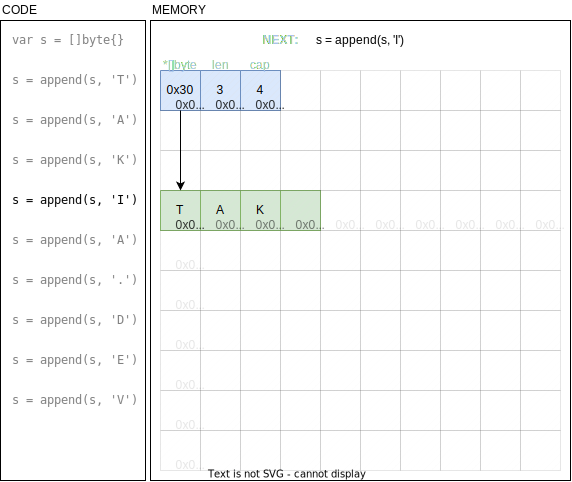
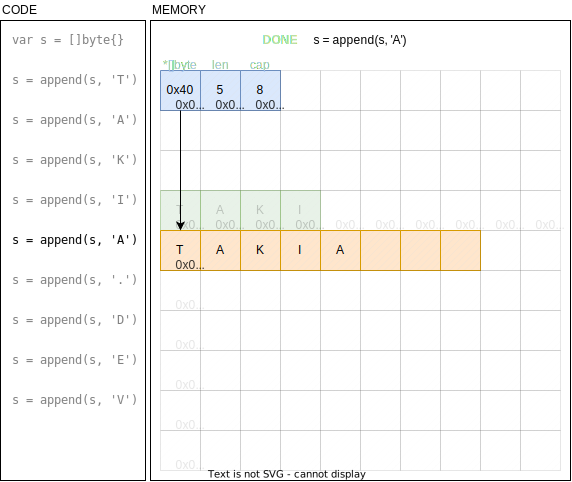
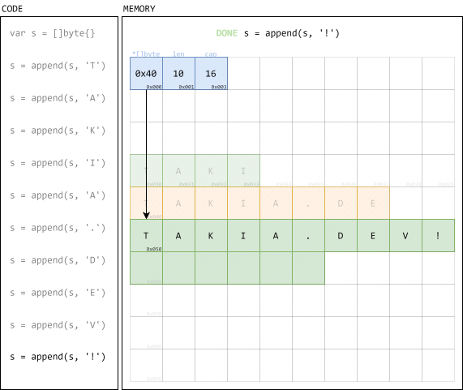

In the Go progamming language, slices are one of the most basic and fundamental data structures. And yet, slices often exhibit strange behaviors: when a slice is passed as argument to a function, some – but not all – of its data can be modified by the function. In this article, we aim for an in-depth understanding of slices and their behavior by looking at how they are implemented under the hood and how the memory behaves when performing common slice operations.

## What are slices? A bird's view

At first glance, slices are Go's equivalent for the `vector` type in C++ or `ArrayList` in Java. A slice is a dynamic array: it's a container that stores a sequence of elements indexed by integers starting from `0`. The elements are stored contiguously in memory. Unlike Go arrays, slices can be resized. In the following code snippet, we illustrate common operations on slices:

```go
// Create a slice of `rune` with initial length
var length = 5
var s = make([]rune, length)

// Access the existing elements in the slice
for i := 0; i < length; i++ {
    s[i] = 'A'
}

// Append a new element to the slice
s = append(s, 'B')

// print the new length of the slice
println(len(s)) // 6
```

## How are slices implemented?

Under the hood, slices are implemented as a `struct` with three variables: a pointer to the data array, the length of the slice and the capacity of the slice. In this section, we will use valid Go code to shed light on this hidden implementation.

For instance, the following diagram illustrates the memory layout of a slice `s` with length `5`  and capacity `7`. The elements of `s` are `{1, 2, 3, 4, 5}`, they are stored contiguously at memory location `0xe830`.



Because the slice object only contains a pointer to the data array and not the array itself, the actual size of the array does not impact the size of the slice object. For instance, in the code below we create two slices, one with 0 elements and one with 5 elements, but `Sizeof` shows that the size of the slice objects is 24 bytes either way.

```go
var s0 = []int{}
var s1 = []int{1, 2, 3, 4, 5}
println(unsafe.Sizeof(s0)) // 24 bytes
println(unsafe.Sizeof(s1)) // 24 bytes
```

## What happens when an element is added to a slice?

Since the elements of a slice are stored contiguously in memory, it can happen that there is not enough space at the end of the slice to add a new element. In this case, a new memory location with more space is allocated to the slice and the elements are copied to the new location. Go keeps track of how much space is reserved for the slice through the `capacity` value and will roughly double the capacity every time the slice is reallocated.

The slideshow below illustrates what happens in memory when we append elements to a slice. Use the buttons to move to the next codeline.

<div class="highlight instantCarousel">
<div class="navigationContainer"> <a class="navigationButton prev">prev</a> <a class="navigationButton next">next</a> </div>
<div class="viewContainer">
<div class="carouselPane currentPane"></div>
<div class="carouselPane"></div>
<div class="carouselPane"></div>
<div class="carouselPane"></div>
<div class="carouselPane"></div>
<div class="carouselPane"></div>
<div class="carouselPane"></div>
<div class="carouselPane"></div>
<div class="carouselPane"></div>
<div class="carouselPane"></div>
<div class="carouselPane"></div>
<div class="carouselPane"></div>
<div class="carouselPane"></div>
<div class="carouselPane"></div>
<div class="carouselPane"></div>
<div class="carouselPane"></div>
<div class="carouselPane"></div>
<div class="carouselPane"></div>
<div class="carouselPane"></div>
<div class="carouselPane"></div>
<div class="carouselPane"></div>
</div>
<div class="navigationContainer"> <a class="navigationButton prev">prev</a> <a class="navigationButton next">next</a> </div>
</div>
<script>
    for (elem of document.querySelectorAll(".instantCarousel .navigationContainer .prev")) {
        elem.addEventListener("click", function() {
            panes = document.querySelectorAll(".instantCarousel .viewContainer .carouselPane");
            for (let i = 0; i < panes.length; i++) {
                let item = panes[panes.length-1-i];
                if (item.classList.contains("currentPane")) {
                    let nextItem = panes[panes.length-1-((i+1)%panes.length)];
                    item.classList.toggle("currentPane");
                    nextItem.classList.toggle("currentPane");
                    break;
                }
            }
        });
    };
    for (elem of document.querySelectorAll(".instantCarousel .navigationContainer .next")) {
        elem.addEventListener("click", function() {
            panes = document.querySelectorAll(".instantCarousel .viewContainer .carouselPane");
            for (let i = 0; i < panes.length; i++) {
                let item = panes[i];
                if (item.classList.contains("currentPane")) {
                    let nextItem = panes[(i+1)%panes.length];
                    item.classList.toggle("currentPane");
                    nextItem.classList.toggle("currentPane");
                    break;
                }
            }
        });
    };
</script>

<style>
.instantCarousel {
    background-color: var(--pre-background-color);
    width: 100%;
    margin: 0 auto;
    padding: 0;
    -webkit-user-select: none; /* Safari */
    -ms-user-select: none; /* IE 10 and IE 11 */
    user-select: none; /* Standard syntax */
    max-height: 100vh;
}
.instantCarousel .viewContainer {
    overflow: hidden;
    position: relative;
    scroll-direction: horizontal;
    margin: 0 auto;
    flex-grow: 1;
}
.instantCarousel .carouselPane {
    display: none;
    width: 100%;
}
.instantCarousel .carouselPane img {
    width: 100%;
    max-width: 100vw;
    max-height:80vh;
}
.instantCarousel .currentPane {
    display: block;
}
.instantCarousel .navigationContainer {
    text-align: center;
    margin: 0 auto;
}
.instantCarousel .navigationContainer .navigationButton {
    cursor: pointer;
    color: var(--accent-color-text);
    background-color: var(--accent-color);
    background-color: #0177b8;
    padding: 8px 16px;
    border-radius: var(--tag-border-radius);
    display: inline-block;
    font-size: 1.4rem;
    transition: background-color .5s ease;
}
</style>

## Revealing the underlying struct implementation
We can use pointer tricks to force the compiler to reveal this hidden struct by reinterpreting the memory address as a struct pointer. This is what the `reinterpretAsStruct` function does in the code below:

```go
import (
	"fmt"
	"unsafe"
)

type SliceStruct struct {
	array    *[100]int
	length   int
	capacity int
}

func reinterpretAsStruct(sliceObject []int) SliceStruct {
	var pointerToSlice = unsafe.Pointer(&sliceObject)
	var pointerToStruct = (*SliceStruct)(pointerToSlice)
	var structObject SliceStruct = *pointerToStruct
	return structObject
}

func main() {
	var s []int = make([]int, 3, 15)

	var struct1 SliceStruct = reinterpretAsStruct(s)

	fmt.Printf("Underlying array address: %p\n", &s[0])
	fmt.Printf("Length: %d\n", len(s))
	fmt.Printf("Capacity: %d\n", cap(s))
	fmt.Printf("%v\n", struct1)
}
```

Since the array pointers are the same, every modification in the `struct1.array` is automatically reflected in the slice `s`:

```go
fmt.Printf("Before: s[1] == %d\n", s[1]) // 0
struct1.array[1] = 42
fmt.Printf("After: s[1] == %d\n", s[1]) // 42
```

## Passing a slice as argument to a function

When a slice is passed as argument to a function, the underlying `struct` object is *passed by value* to the function, which means that the function receives a *copy* of the struct object. 

The diagram below illustrates what happens when passing a slice `s` to the function `giveMeSlice`:

```go
func giveMeSlice(arg []int) { ... }

giveMeSlice(s)
```


Even though the function only receives a *copy* of the array pointer, it can still access the original elements by following the pointer. This explains why a function can modify the elements of a slice.

But when the function resizes a slice, then only its own *copy* of the length and capacity variables are updated and this update is not propagated to the original slice object.

The code below illustrates these considerations:

```go
func giveMeSlice(arg []int) {
	fmt.Printf("[in function] Slice address: %p\n", &arg)    // 0x8060
	fmt.Printf("[in function] Array address: %p\n", &arg[0]) // 0xe180
}

func main() {
	var s []int = make([]int, 5, 7)
	fmt.Printf("Slice address: %p\n", &s)     // 0x8030
	fmt.Printf("Array address: %p\n", &s[0])  // 0xe180
	giveMeSlice(s)
}
```
