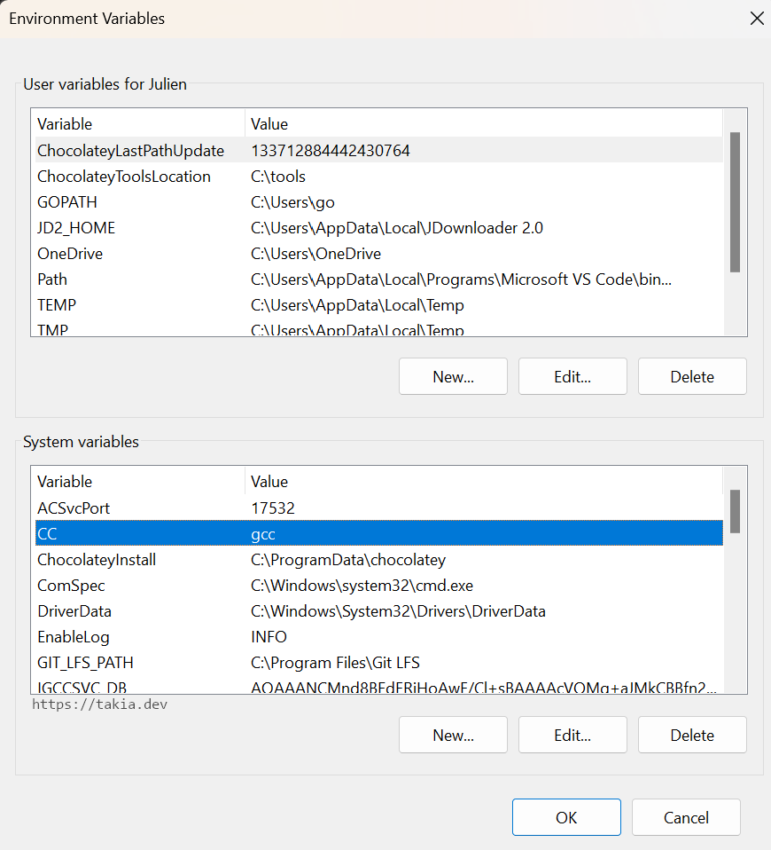

A common error on Windows 10 and Windows 11 that pops up when attempting to use neotest-golang in neovim is the infamous "**Test(s) not associated (not found/executed)**".

This error happens because neotest-golang is unable to read the output of the test command. There are several reasons why neotest-golang might not be able to parse the output of your tests, here are the most common ways to fix it.


## Use gotestsum

On windows, you can fix it by changing the test runner to `gotestsum` as follows:

First, install `gotestsum`:

```
go install gotest.tools/gotestsum@latest
```

Then, configure neotest-golang to use the new runner:

``` 
require("neotest").setup({
  adapters = {
    require("neotest-golang")({
      runner = "gotestsum"
    }),
  },
})
```

For example, if you are using `lazy.nvim` plugin manager or the `LazyVim` distribution, here is how to do it: create a new file in the plugins directory with this content:

```lua
-- file: lua/plugins/neotest-golang.lua
return {
    {
        "nvim-neotest/neotest",
        optional = true,
        dependencies = {
          "fredrikaverpil/neotest-golang",
        },
        opts = {
          adapters = {
            ["neotest-golang"] = {
              -- Here we can set options for neotest-golang, e.g.
              -- go_test_args = { "-v", "-race", "-count=1", "-timeout=60s" },
              dap_go_enabled = true, -- requires leoluz/nvim-dap-go
              runner = "gotestsum",
              go_test_args = {
                "-v",
                "-race",
                "-count=1",
                -- "-coverprofile=" .. vim.fn.getcwd() .. "/coverage.out",
              }
            },
          },
        },
    },
}
```

The configuration options for `gotestsum` in neotest-golang is available in this unmerged pull request (as of now at least): [documentation](https://github.com/fredrikaverpil/neotest-golang/pull/150).


Source: [relevant issue](https://github.com/fredrikaverpil/neotest-golang/issues/147)


## Ubuntu: do not use the snaps install

On ubuntu, installing GO via snaps cause and output issue when running from nvim which prevents neotest-golang from collecting the test outputs. Instead, download the go tarball and install it from there.

Source: [Relevant issue](https://github.com/fredrikaverpil/neotest-golang/discussions/161).

## Windows: Install mingw GCC

Neotest-golang by default attempts to run the tests with the flag `-race`. On windows, you can only run `go test -race` if you have gcc installed. Thankfully the fix is easy. First, install `mingw` as follows:

```
# In powershell with admin rights
choco install mingw
```

Then make sure that `$env:CC` is set to `gcc` by editing your environment variables as shows in the screenshots below.


 


Alternatively you can also remove the `-race` flag from you neotest-golang configuration as follows:

```lua 
require("neotest").setup({
  adapters = {
    require("neotest-golang")({
      runner = "gotestsum",
      go_test_args = {
        "-v",
        -- "-race", -- remove the -race flag
        "-count=1",
      }
    }),
  },
})
```

Or, if you use either `lazy.nvim` or `LazyVim` create a file in the `plugins` directory with this content:

```lua
-- file: lua/plugins/neotest-golang.lua
return {
    {
        "nvim-neotest/neotest",
        optional = true,
        dependencies = {
          "fredrikaverpil/neotest-golang",
        },
        opts = {
          adapters = {
            ["neotest-golang"] = {
              runner = "gotestsum",
              go_test_args = {
                "-v",
                -- "-race", -- remove the -race flag
                "-count=1",
              }
            },
          },
        },
    },
```

Source: [relevant issue](https://github.com/fredrikaverpil/neotest-golang/issues/193).


## Some error outputs

Here are some error outputs you might come accross when attempting to solve these errors.


```
DEBUG | 2024-09-20T10:12:41Z+0400 | ...cal/nvim-data/lazy/neotest/lua/neotest/lib/file/init.lua:225 | Path separator: \
INFO | 2024-09-20T10:12:41Z+0400 | ...al/nvim-data/lazy/neotest/lua/neotest/lib/subprocess.lua:33 | Starting child process
INFO | 2024-09-20T10:12:41Z+0400 | ...al/nvim-data/lazy/neotest/lua/neotest/lib/subprocess.lua:36 | Parent address: localhost:54013
INFO | 2024-09-20T10:12:41Z+0400 | ...al/nvim-data/lazy/neotest/lua/neotest/lib/subprocess.lua:42 | Starting child process with command: C:\Program Files\Neovim\bin\nvim.exe --embed --headless -n
INFO | 2024-09-20T10:12:41Z+0400 | ...Local/nvim-data/lazy/neotest/lua/neotest/client/init.lua:378 | Initialising client
INFO | 2024-09-20T10:12:41Z+0400 | ...vim-data/lazy/neotest/lua/neotest/client/events/init.lua:48 | Emitting starting event
DEBUG | 2024-09-20T10:12:41Z+0400 | ...vim-data/lazy/neotest/lua/neotest/client/events/init.lua:50 | Calling listener summary for event starting
INFO | 2024-09-20T10:12:41Z+0400 | ...cal/nvim-data/lazy/neotest/lua/neotest/adapters/init.lua:18 | Found 1 adapters for directory C:\Users\takia.dev\Documents\mydocs\src\golang\tutorial\greetings
DEBUG | 2024-09-20T10:12:41Z+0400 | ...cal/nvim-data/lazy/neotest/lua/neotest/adapters/init.lua:19 | Adapters: { {
    adapter = {
      build_spec = <function 1>,
      discover_positions = <function 2>,
      filter_dir = <function 3>,
      init = <function 4>,
      is_test_file = <function 5>,
      name = "neotest-golang",
      results = <function 6>,
      root = <function 7>,
      <metatable> = {
        __call = <function 8>
      }
    },
    root = "C:\\Users\\takia.dev\\Documents\\mydocs\\src\\golang\\tutorial\\greetings"
  } }
INFO | 2024-09-20T10:12:41Z+0400 | ...Local/nvim-data/lazy/neotest/lua/neotest/client/init.lua:279 | Searching C:\Users\takia.dev\Documents\mydocs\src\golang\tutorial\greetings for test files
DEBUG | 2024-09-20T10:12:41Z+0400 | ...Local/nvim-data/lazy/neotest/lua/neotest/client/init.lua:295 | Found { {
    id = "C:\\Users\\takia.dev\\Documents\\mydocs\\src\\golang\\tutorial\\greetings",
    name = "greetings",
    path = "C:\\Users\\takia.dev\\Documents\\mydocs\\src\\golang\\tutorial\\greetings",
    type = "dir"
  }, { {
      id = "C:\\Users\\takia.dev\\Documents\\mydocs\\src\\golang\\tutorial\\greetings\\greetings_test.go",
      name = "greetings_test.go",
      path = "C:\\Users\\takia.dev\\Documents\\mydocs\\src\\golang\\tutorial\\greetings\\greetings_test.go",
      type = "file"
    } } }
DEBUG | 2024-09-20T10:12:41Z+0400 | ...nvim-data/lazy/neotest/lua/neotest/client/state/init.lua:54 | New positions at ID C:\Users\takia.dev\Documents\mydocs\src\golang\tutorial\greetings
INFO | 2024-09-20T10:12:41Z+0400 | ...vim-data/lazy/neotest/lua/neotest/client/events/init.lua:48 | Emitting discover_positions event
DEBUG | 2024-09-20T10:12:41Z+0400 | ...vim-data/lazy/neotest/lua/neotest/client/events/init.lua:50 | Calling listener summary for event discover_positions
DEBUG | 2024-09-20T10:12:41Z+0400 | ...vim-data/lazy/neotest/lua/neotest/client/events/init.lua:50 | Calling listener diagnostic for event discover_positions
INFO | 2024-09-20T10:12:41Z+0400 | ...Local/nvim-data/lazy/neotest/lua/neotest/client/init.lua:325 | Discovering files with 24 workers
DEBUG | 2024-09-20T10:12:41Z+0400 | ...vim-data/lazy/neotest/lua/neotest/client/events/init.lua:50 | Calling listener status for event discover_positions
DEBUG | 2024-09-20T10:12:41Z+0400 | ...vim-data/lazy/neotest/lua/neotest/client/events/init.lua:50 | Calling listener state for event discover_positions
INFO | 2024-09-20T10:12:41Z+0400 | ...Local/nvim-data/lazy/neotest/lua/neotest/client/init.lua:299 | Parsing C:\Users\takia.dev\Documents\mydocs\src\golang\tutorial\greetings\greetings_test.go
DEBUG | 2024-09-20T10:12:41Z+0400 | ...al/nvim-data/lazy/neotest/lua/neotest/lib/subprocess.lua:140 | Waiting for result 1
DEBUG | 2024-09-20T10:12:41Z+0400 | ...al/nvim-data/lazy/neotest/lua/neotest/lib/subprocess.lua:91 | Result registed for callback 1
DEBUG | 2024-09-20T10:12:41Z+0400 | ...Local/nvim-data/lazy/neotest/lua/neotest/client/init.lua:305 | Found { {
    id = "C:\\Users\\takia.dev\\Documents\\mydocs\\src\\golang\\tutorial\\greetings\\greetings_test.go",
    name = "greetings_test.go",
    path = "C:\\Users\\takia.dev\\Documents\\mydocs\\src\\golang\\tutorial\\greetings\\greetings_test.go",
    range = { 0, 0, 22, 0 },
    type = "file"
  }, { {
      id = "C:\\Users\\takia.dev\\Documents\\mydocs\\src\\golang\\tutorial\\greetings\\greetings_test.go::TestHelloName",
      name = "TestHelloName",
      path = "C:\\Users\\takia.dev\\Documents\\mydocs\\src\\golang\\tutorial\\greetings\\greetings_test.go",
      range = { 7, 0, 14, 1 },
      type = "test"
    } }, { {
      id = "C:\\Users\\takia.dev\\Documents\\mydocs\\src\\golang\\tutorial\\greetings\\greetings_test.go::TestHelloEmpty",
      name = "TestHelloEmpty",
      path = "C:\\Users\\takia.dev\\Documents\\mydocs\\src\\golang\\tutorial\\greetings\\greetings_test.go",
      range = { 16, 0, 21, 1 },
      type = "test"
    } } }
DEBUG | 2024-09-20T10:12:41Z+0400 | ...nvim-data/lazy/neotest/lua/neotest/client/state/init.lua:54 | New positions at ID C:\Users\takia.dev\Documents\mydocs\src\golang\tutorial\greetings\greetings_test.go
INFO | 2024-09-20T10:12:41Z+0400 | ...vim-data/lazy/neotest/lua/neotest/client/events/init.lua:48 | Emitting discover_positions event
DEBUG | 2024-09-20T10:12:41Z+0400 | ...vim-data/lazy/neotest/lua/neotest/client/events/init.lua:50 | Calling listener summary for event discover_positions
DEBUG | 2024-09-20T10:12:41Z+0400 | ...vim-data/lazy/neotest/lua/neotest/client/events/init.lua:50 | Calling listener diagnostic for event discover_positions
DEBUG | 2024-09-20T10:12:41Z+0400 | ...vim-data/lazy/neotest/lua/neotest/client/events/init.lua:50 | Calling listener status for event discover_positions
DEBUG | 2024-09-20T10:12:41Z+0400 | ...vim-data/lazy/neotest/lua/neotest/client/events/init.lua:50 | Calling listener state for event discover_positions
INFO | 2024-09-20T10:12:41Z+0400 | ...Local/nvim-data/lazy/neotest/lua/neotest/client/init.lua:494 | Initialisation finished in 0.03 seconds
INFO | 2024-09-20T10:12:41Z+0400 | ...vim-data/lazy/neotest/lua/neotest/client/events/init.lua:48 | Emitting test_file_focused event
DEBUG | 2024-09-20T10:12:41Z+0400 | ...vim-data/lazy/neotest/lua/neotest/client/events/init.lua:50 | Calling listener summary for event test_file_focused
DEBUG | 2024-09-20T10:12:41Z+0400 | ...vim-data/lazy/neotest/lua/neotest/client/events/init.lua:50 | Calling listener diagnostic for event test_file_focused
DEBUG | 2024-09-20T10:12:41Z+0400 | ...vim-data/lazy/neotest/lua/neotest/client/events/init.lua:50 | Calling listener status for event test_file_focused
INFO | 2024-09-20T10:12:41Z+0400 | ...vim-data/lazy/neotest/lua/neotest/client/events/init.lua:48 | Emitting started event
DEBUG | 2024-09-20T10:12:41Z+0400 | ...vim-data/lazy/neotest/lua/neotest/client/events/init.lua:50 | Calling listener summary for event started
DEBUG | 2024-09-20T10:12:41Z+0400 | ...nvim-data/lazy/neotest/lua/neotest/client/state/init.lua:85 | Setting positions to running C:\Users\takia.dev\Documents\mydocs\src\golang\tutorial\greetings\greetings_test.go
INFO | 2024-09-20T10:12:41Z+0400 | ...vim-data/lazy/neotest/lua/neotest/client/events/init.lua:48 | Emitting run event
DEBUG | 2024-09-20T10:12:41Z+0400 | ...vim-data/lazy/neotest/lua/neotest/client/events/init.lua:50 | Calling listener summary for event run
DEBUG | 2024-09-20T10:12:41Z+0400 | ...vim-data/lazy/neotest/lua/neotest/client/events/init.lua:50 | Calling listener diagnostic for event run
DEBUG | 2024-09-20T10:12:41Z+0400 | ...vim-data/lazy/neotest/lua/neotest/client/events/init.lua:50 | Calling listener status for event run
DEBUG | 2024-09-20T10:12:41Z+0400 | ...vim-data/lazy/neotest/lua/neotest/client/events/init.lua:50 | Calling listener state for event run
DEBUG | 2024-09-20T10:12:41Z+0400 | ...-data/lazy/neotest-golang/lua/neotest-golang/logging.lua:47 | [neotest-golang] Searching for go.mod in C:\Users\takia.dev\Documents\mydocs\src\golang\tutorial\greetings
DEBUG | 2024-09-20T10:12:41Z+0400 | ...-data/lazy/neotest-golang/lua/neotest-golang/logging.lua:47 | [neotest-golang] Found go.mod at C:\Users\takia.dev\Documents\mydocs\src\golang\tutorial\greetings\go.mod
DEBUG | 2024-09-20T10:12:41Z+0400 | ...-data/lazy/neotest-golang/lua/neotest-golang/logging.lua:47 | [neotest-golang] Running Go list: go list -json ./... in C:\Users\takia.dev\Documents\mydocs\src\golang\tutorial\greetings
DEBUG | 2024-09-20T10:12:41Z+0400 | ...-data/lazy/neotest-golang/lua/neotest-golang/logging.lua:47 | [neotest-golang] JSON-decoded 'go list' output:  { {
    Deps = { "cmp", "errors", "fmt", "internal/abi", "internal/asan", "internal/bisect", "internal/bytealg", "internal/byteorder", "internal/chacha8rand", "internal/coverage/rtcov", "internal/cpu", "internal/filepathlite", "internal/fmtsort", "internal/goarch", "internal/godebug", "internal/godebugs", "internal/goexperiment", "internal/goos", "internal/itoa", "internal/msan", "internal/oserror", "internal/poll", "internal/profilerecord", "internal/race", "internal/reflectlite", "internal/runtime/atomic", "internal/runtime/exithook", "internal/stringslite", "internal/syscall/execenv", "internal/syscall/windows", "internal/syscall/windows/registry", "internal/syscall/windows/sysdll", "internal/testlog", "internal/unsafeheader", "io", "io/fs", "iter", "math", "math/bits", "math/rand", "os", "path", "reflect", "runtime", "runtime/internal/math", "runtime/internal/sys", "slices", "strconv", "sync", "sync/atomic", "syscall", "time", "unicode", "unicode/utf16", "unicode/utf8", "unsafe" },
    Dir = "C:\\Users\\takia.dev\\Documents\\mydocs\\src\\golang\\tutorial\\greetings",
    GoFiles = { "greetings.go" },
    ImportPath = "takia.dev/greetings",
    Imports = { "errors", "fmt", "math/rand" },
    Match = { "./..." },
    Module = {
      Dir = "C:\\Users\\takia.dev\\Documents\\mydocs\\src\\golang\\tutorial\\greetings",
      GoMod = "C:\\Users\\takia.dev\\Documents\\mydocs\\src\\golang\\tutorial\\greetings\\go.mod",
      GoVersion = "1.23.0",
      Main = true,
      Path = "takia.dev/greetings"
    },
    Name = "greetings",
    Root = "C:\\Users\\takia.dev\\Documents\\mydocs\\src\\golang\\tutorial\\greetings",
    Stale = true,
    StaleReason = "build ID mismatch",
    TestGoFiles = { "greetings_test.go" },
    TestImports = { "regexp", "testing" }
  } }
INFO | 2024-09-20T10:12:41Z+0400 | ...-data/lazy/neotest-golang/lua/neotest-golang/logging.lua:59 | [neotest-golang] Test command: gotestsum --jsonfile=C:/Users/takia.dev/AppData/Local/Temp/nvim.0/Ajb5cu/1 --format=standard-verbose -- -v -race -count=1 takia.dev/greetings -run ^(^TestHelloName$|^TestHelloEmpty$)$
DEBUG | 2024-09-20T10:12:41Z+0400 | ...-data/lazy/neotest-golang/lua/neotest-golang/logging.lua:47 | [neotest-golang] RunSpec: {
  command = { "gotestsum", "--jsonfile=C:/Users/takia.dev/AppData/Local/Temp/nvim.0/Ajb5cu/1", "--format=standard-verbose", "--", "-v", "-race", "-count=1", "takia.dev/greetings", "-run", "^(^TestHelloName$|^TestHelloEmpty$)$" },
  context = {
    golist_data = { {
        Deps = { "cmp", "errors", "fmt", "internal/abi", "internal/asan", "internal/bisect", "internal/bytealg", "internal/byteorder", "internal/chacha8rand", "internal/coverage/rtcov", "internal/cpu", "internal/filepathlite", "internal/fmtsort", "internal/goarch", "internal/godebug", "internal/godebugs", "internal/goexperiment", "internal/goos", "internal/itoa", "internal/msan", "internal/oserror", "internal/poll", "internal/profilerecord", "internal/race", "internal/reflectlite", "internal/runtime/atomic", "internal/runtime/exithook", "internal/stringslite", "internal/syscall/execenv", "internal/syscall/windows", "internal/syscall/windows/registry", "internal/syscall/windows/sysdll", "internal/testlog", "internal/unsafeheader", "io", "io/fs", "iter", "math", "math/bits", "math/rand", "os", "path", "reflect", "runtime", "runtime/internal/math", "runtime/internal/sys", "slices", "strconv", "sync", "sync/atomic", "syscall", "time", "unicode", "unicode/utf16", "unicode/utf8", "unsafe" },
        Dir = "C:\\Users\\takia.dev\\Documents\\mydocs\\src\\golang\\tutorial\\greetings",
        GoFiles = { "greetings.go" },
        ImportPath = "takia.dev/greetings",
        Imports = { "errors", "fmt", "math/rand" },
        Match = { "./..." },
        Module = {
          Dir = "C:\\Users\\takia.dev\\Documents\\mydocs\\src\\golang\\tutorial\\greetings",
          GoMod = "C:\\Users\\takia.dev\\Documents\\mydocs\\src\\golang\\tutorial\\greetings\\go.mod",
          GoVersion = "1.23.0",
          Main = true,
          Path = "takia.dev/greetings"
        },
        Name = "greetings",
        Root = "C:\\Users\\takia.dev\\Documents\\mydocs\\src\\golang\\tutorial\\greetings",
        Stale = true,
        StaleReason = "build ID mismatch",
        TestGoFiles = { "greetings_test.go" },
        TestImports = { "regexp", "testing" }
      } },
    pos_id = "C:\\Users\\takia.dev\\Documents\\mydocs\\src\\golang\\tutorial\\greetings\\greetings_test.go",
    test_output_json_filepath = "C:/Users/takia.dev/AppData/Local/Temp/nvim.0/Ajb5cu/1"
  },
  cwd = "C:\\Users\\takia.dev\\Documents\\mydocs\\src\\golang\\tutorial\\greetings"
}
INFO | 2024-09-20T10:12:41Z+0400 | ...data/lazy/neotest/lua/neotest/client/strategies/init.lua:36 | Starting process neotest-golang:C:\Users\takia.dev\Documents\mydocs\src\golang\tutorial\greetings-C:\Users\takia.dev\Documents\mydocs\src\golang\tutorial\greetings\greetings_test.go with strategy integrated
DEBUG | 2024-09-20T10:12:41Z+0400 | ...data/lazy/neotest/lua/neotest/client/strategies/init.lua:37 | Strategy spec {
  command = { "gotestsum", "--jsonfile=C:/Users/takia.dev/AppData/Local/Temp/nvim.0/Ajb5cu/1", "--format=standard-verbose", "--", "-v", "-race", "-count=1", "takia.dev/greetings", "-run", "^(^TestHelloName$|^TestHelloEmpty$)$" },
  context = {
    golist_data = { {
        Deps = { "cmp", "errors", "fmt", "internal/abi", "internal/asan", "internal/bisect", "internal/bytealg", "internal/byteorder", "internal/chacha8rand", "internal/coverage/rtcov", "internal/cpu", "internal/filepathlite", "internal/fmtsort", "internal/goarch", "internal/godebug", "internal/godebugs", "internal/goexperiment", "internal/goos", "internal/itoa", "internal/msan", "internal/oserror", "internal/poll", "internal/profilerecord", "internal/race", "internal/reflectlite", "internal/runtime/atomic", "internal/runtime/exithook", "internal/stringslite", "internal/syscall/execenv", "internal/syscall/windows", "internal/syscall/windows/registry", "internal/syscall/windows/sysdll", "internal/testlog", "internal/unsafeheader", "io", "io/fs", "iter", "math", "math/bits", "math/rand", "os", "path", "reflect", "runtime", "runtime/internal/math", "runtime/internal/sys", "slices", "strconv", "sync", "sync/atomic", "syscall", "time", "unicode", "unicode/utf16", "unicode/utf8", "unsafe" },
        Dir = "C:\\Users\\takia.dev\\Documents\\mydocs\\src\\golang\\tutorial\\greetings",
        GoFiles = { "greetings.go" },
        ImportPath = "takia.dev/greetings",
        Imports = { "errors", "fmt", "math/rand" },
        Match = { "./..." },
        Module = {
          Dir = "C:\\Users\\takia.dev\\Documents\\mydocs\\src\\golang\\tutorial\\greetings",
          GoMod = "C:\\Users\\takia.dev\\Documents\\mydocs\\src\\golang\\tutorial\\greetings\\go.mod",
          GoVersion = "1.23.0",
          Main = true,
          Path = "takia.dev/greetings"
        },
        Name = "greetings",
        Root = "C:\\Users\\takia.dev\\Documents\\mydocs\\src\\golang\\tutorial\\greetings",
        Stale = true,
        StaleReason = "build ID mismatch",
        TestGoFiles = { "greetings_test.go" },
        TestImports = { "regexp", "testing" }
      } },
    pos_id = "C:\\Users\\takia.dev\\Documents\\mydocs\\src\\golang\\tutorial\\greetings\\greetings_test.go",
    test_output_json_filepath = "C:/Users/takia.dev/AppData/Local/Temp/nvim.0/Ajb5cu/1"
  },
  cwd = "C:\\Users\\takia.dev\\Documents\\mydocs\\src\\golang\\tutorial\\greetings",
  strategy = {
    height = 40,
    width = 120
  }
}
INFO | 2024-09-20T10:12:41Z+0400 | ...vim-data/lazy/neotest/lua/neotest/client/events/init.lua:48 | Emitting test_focused event
DEBUG | 2024-09-20T10:12:41Z+0400 | ...vim-data/lazy/neotest/lua/neotest/client/events/init.lua:50 | Calling listener summary for event test_focused
INFO | 2024-09-20T10:12:42Z+0400 | ...data/lazy/neotest/lua/neotest/client/strategies/init.lua:56 | Process for position neotest-golang:C:\Users\takia.dev\Documents\mydocs\src\golang\tutorial\greetings-C:\Users\takia.dev\Documents\mydocs\src\golang\tutorial\greetings\greetings_test.go exited with code 1
DEBUG | 2024-09-20T10:12:42Z+0400 | ...data/lazy/neotest/lua/neotest/client/strategies/init.lua:58 | Output of process  C:\Users\takia.dev\AppData\Local\Temp\nvim.0\Ajb5cu\2
DEBUG | 2024-09-20T10:12:42Z+0400 | ...-data/lazy/neotest-golang/lua/neotest-golang/logging.lua:47 | [neotest-golang] Raw 'go test' output:  { '{"Time":"2024-09-20T10:12:42.738978+04:00","Action":"start","Package":"takia.dev/greetings"}', '{"Time":"2024-09-20T10:12:42.738978+04:00","Action":"output","Package":"takia.dev/greetings","Output":"FAIL\\ttakia.dev/greetings [build failed]\\n"}', '{"Time":"2024-09-20T10:12:42.738978+04:00","Action":"fail","Package":"takia.dev/greetings","Elapsed":0}' }
DEBUG | 2024-09-20T10:12:42Z+0400 | ...-data/lazy/neotest-golang/lua/neotest-golang/logging.lua:47 | [neotest-golang] Final internal test result data {
  ["C:\\Users\\takia.dev\\Documents\\mydocs\\src\\golang\\tutorial\\greetings\\greetings_test.go::TestHelloEmpty"] = {
    duplicate_test_detected = false,
    errors = {},
    gotest_data = {
      name = "",
      output = {},
      pkg = ""
    },
    neotest_data = {
      id = "C:\\Users\\takia.dev\\Documents\\mydocs\\src\\golang\\tutorial\\greetings\\greetings_test.go::TestHelloEmpty",
      name = "TestHelloEmpty",
      path = "C:\\Users\\takia.dev\\Documents\\mydocs\\src\\golang\\tutorial\\greetings\\greetings_test.go",
      range = { 16, 0, 21, 1 },
      type = "test"
    },
    status = "skipped"
  },
  ["C:\\Users\\takia.dev\\Documents\\mydocs\\src\\golang\\tutorial\\greetings\\greetings_test.go::TestHelloName"] = {
    duplicate_test_detected = false,
    errors = {},
    gotest_data = {
      name = "",
      output = {},
      pkg = ""
    },
    neotest_data = {
      id = "C:\\Users\\takia.dev\\Documents\\mydocs\\src\\golang\\tutorial\\greetings\\greetings_test.go::TestHelloName",
      name = "TestHelloName",
      path = "C:\\Users\\takia.dev\\Documents\\mydocs\\src\\golang\\tutorial\\greetings\\greetings_test.go",
      range = { 7, 0, 14, 1 },
      type = "test"
    },
    status = "skipped"
  }
}
WARN | 2024-09-20T10:12:42Z+0400 | ...-data/lazy/neotest-golang/lua/neotest-golang/logging.lua:69 | [neotest-golang] Test(s) not associated (not found/executed):  { "C:\\Users\\takia.dev\\Documents\\mydocs\\src\\golang\\tutorial\\greetings\\greetings_test.go::TestHelloEmpty", "C:\\Users\\takia.dev\\Documents\\mydocs\\src\\golang\\tutorial\\greetings\\greetings_test.go::TestHelloName" }
DEBUG | 2024-09-20T10:12:42Z+0400 | ...-data/lazy/neotest-golang/lua/neotest-golang/logging.lua:47 | [neotest-golang] Final Neotest result data {
  ["C:\\Users\\takia.dev\\Documents\\mydocs\\src\\golang\\tutorial\\greetings\\greetings_test.go"] = {
    output = "C:/Users/takia.dev/AppData/Local/Temp/nvim.0/Ajb5cu/5",
    status = "failed"
  },
  ["C:\\Users\\takia.dev\\Documents\\mydocs\\src\\golang\\tutorial\\greetings\\greetings_test.go::TestHelloEmpty"] = {
    errors = {},
    output = "C:/Users/takia.dev/AppData/Local/Temp/nvim.0/Ajb5cu/3",
    status = "skipped"
  },
  ["C:\\Users\\takia.dev\\Documents\\mydocs\\src\\golang\\tutorial\\greetings\\greetings_test.go::TestHelloName"] = {
    errors = {},
    output = "C:/Users/takia.dev/AppData/Local/Temp/nvim.0/Ajb5cu/4",
    status = "skipped"
  }
}
DEBUG | 2024-09-20T10:12:42Z+0400 | ...nvim-data/lazy/neotest/lua/neotest/client/state/init.lua:70 | New results for adapter neotest-golang:C:\Users\takia.dev\Documents\mydocs\src\golang\tutorial\greetings
INFO | 2024-09-20T10:12:42Z+0400 | ...vim-data/lazy/neotest/lua/neotest/client/events/init.lua:48 | Emitting results event
DEBUG | 2024-09-20T10:12:42Z+0400 | ...vim-data/lazy/neotest/lua/neotest/client/events/init.lua:50 | Calling listener status for event results
DEBUG | 2024-09-20T10:12:42Z+0400 | ...vim-data/lazy/neotest/lua/neotest/client/events/init.lua:50 | Calling listener output for event results
DEBUG | 2024-09-20T10:12:42Z+0400 | ...vim-data/lazy/neotest/lua/neotest/client/events/init.lua:50 | Calling listener state for event results
DEBUG | 2024-09-20T10:12:42Z+0400 | ...vim-data/lazy/neotest/lua/neotest/client/events/init.lua:50 | Calling listener output_panel for event results
DEBUG | 2024-09-20T10:12:42Z+0400 | ...vim-data/lazy/neotest/lua/neotest/client/events/init.lua:50 | Calling listener summary for event results
DEBUG | 2024-09-20T10:12:42Z+0400 | ...vim-data/lazy/neotest/lua/neotest/client/events/init.lua:50 | Calling listener diagnostic for event results
DEBUG | 2024-09-20T10:12:42Z+0400 | ...m-data/lazy/neotest/lua/neotest/consumers/diagnostic.lua:55 | Setting diagnostics for C:\Users\takia.dev\Documents\mydocs\src\golang\tutorial\greetings\greetings_test.go {}
DEBUG | 2024-09-20T10:12:42Z+0400 | ...vim-data/lazy/neotest/lua/neotest/client/events/init.lua:50 | Calling listener trouble for event results
DEBUG | 2024-09-20T10:12:42Z+0400 | ...vim-data/lazy/neotest/lua/neotest/client/events/init.lua:50 | Calling listener quickfix for event results
DEBUG | 2024-09-20T10:12:42Z+0400 | ...nvim-data/lazy/neotest/lua/neotest/client/state/init.lua:70 | New results for adapter neotest-golang:C:\Users\takia.dev\Documents\mydocs\src\golang\tutorial\greetings
INFO | 2024-09-20T10:12:42Z+0400 | ...vim-data/lazy/neotest/lua/neotest/client/events/init.lua:48 | Emitting results event
DEBUG | 2024-09-20T10:12:42Z+0400 | ...vim-data/lazy/neotest/lua/neotest/client/events/init.lua:50 | Calling listener status for event results
DEBUG | 2024-09-20T10:12:42Z+0400 | ...vim-data/lazy/neotest/lua/neotest/client/events/init.lua:50 | Calling listener output for event results
DEBUG | 2024-09-20T10:12:42Z+0400 | ...vim-data/lazy/neotest/lua/neotest/client/events/init.lua:50 | Calling listener state for event results
DEBUG | 2024-09-20T10:12:42Z+0400 | ...vim-data/lazy/neotest/lua/neotest/client/events/init.lua:50 | Calling listener output_panel for event results
DEBUG | 2024-09-20T10:12:43Z+0400 | ...cal/nvim-data/lazy/neotest/lua/neotest/lib/file/init.lua:23 | Reading file: C:/Users/takia.dev/AppData/Local/Temp/nvim.0/Ajb5cu/3
DEBUG | 2024-09-20T10:12:43Z+0400 | ...cal/nvim-data/lazy/neotest/lua/neotest/lib/file/init.lua:23 | Reading file: C:/Users/takia.dev/AppData/Local/Temp/nvim.0/Ajb5cu/4
DEBUG | 2024-09-20T10:12:43Z+0400 | ...vim-data/lazy/neotest/lua/neotest/client/events/init.lua:50 | Calling listener summary for event results
DEBUG | 2024-09-20T10:12:43Z+0400 | ...vim-data/lazy/neotest/lua/neotest/client/events/init.lua:50 | Calling listener diagnostic for event results
DEBUG | 2024-09-20T10:12:43Z+0400 | ...m-data/lazy/neotest/lua/neotest/consumers/diagnostic.lua:55 | Setting diagnostics for C:\Users\takia.dev\Documents\mydocs\src\golang\tutorial\greetings\greetings_test.go {}
DEBUG | 2024-09-20T10:12:43Z+0400 | ...vim-data/lazy/neotest/lua/neotest/client/events/init.lua:50 | Calling listener trouble for event results
DEBUG | 2024-09-20T10:12:43Z+0400 | ...vim-data/lazy/neotest/lua/neotest/client/events/init.lua:50 | Calling listener quickfix for event results
```

which is due to the same error as when running `go test -race`:

```
go test -json -race
# takia.dev/greetings.test
C:\Program Files\Go\pkg\tool\windows_amd64\link.exe: running clang failed: exit status 1104
C:\Program Files (x86)\Microsoft Visual Studio\2022\BuildTools\VC\Tools\Llvm\x64\bin\clang.exe -m64 -s -mconsole -Wl,--tsaware -Wl,--nxcompat -Wl,--major-os-version=6 -Wl,--minor-os-version=1 -Wl,--major-subsystem-version=6 -Wl,--minor-subsystem-version=1 -o $WORK\b001\greetings.test.exe -Qunused-arguments C:\Users\takia.dev\AppData\Local\Temp\go-link-2753284183\go.o C:\Users\takia.dev\AppData\Local\Temp\go-link-2753284183\000000.o C:\Users\takia.dev\AppData\Local\Temp\go-link-2753284183\000001.o C:\Users\takia.dev\AppData\Local\Temp\go-link-2753284183\000002.o C:\Users\takia.dev\AppData\Local\Temp\go-link-2753284183\000003.o C:\Users\takia.dev\AppData\Local\Temp\go-link-2753284183\000004.o C:\Users\takia.dev\AppData\Local\Temp\go-link-2753284183\000005.o C:\Users\takia.dev\AppData\Local\Temp\go-link-2753284183\000006.o C:\Users\takia.dev\AppData\Local\Temp\go-link-2753284183\000007.o C:\Users\takia.dev\AppData\Local\Temp\go-link-2753284183\000008.o C:\Users\takia.dev\AppData\Local\Temp\go-link-2753284183\000009.o C:\Users\takia.dev\AppData\Local\Temp\go-link-2753284183\000010.o -O2 -g -O2 -g -no-pie -Wl,-T,C:\Users\takia.dev\AppData\Local\Temp\go-link-2753284183\fix_debug_gdb_scripts.ld -Wl,--start-group -lmingwex -lmingw32 -Wl,--end-group -lkernel32
LINK : warning LNK4044: unrecognized option '/-tsaware'; ignored
LINK : warning LNK4044: unrecognized option '/-nxcompat'; ignored
LINK : warning LNK4044: unrecognized option '/-major-os-version=6'; ignored
LINK : warning LNK4044: unrecognized option '/-minor-os-version=1'; ignored
LINK : warning LNK4044: unrecognized option '/-major-subsystem-version=6'; ignored
LINK : warning LNK4044: unrecognized option '/-minor-subsystem-version=1'; ignored
LINK : warning LNK4044: unrecognized option '/T'; ignored
LINK : warning LNK4044: unrecognized option '/-start-group'; ignored
LINK : warning LNK4044: unrecognized option '/-end-group'; ignored
LINK : fatal error LNK1104: cannot open file 'mingwex.lib'
clang: error: linker command failed with exit code 1104 (use -v to see invocation)

{"Time":"2024-09-20T10:32:59.8864019+04:00","Action":"start","Package":"takia.dev/greetings"}
{"Time":"2024-09-20T10:32:59.8864019+04:00","Action":"output","Package":"takia.dev/greetings","Output":"FAIL\ttakia.dev/greetings [build failed]\n"}
{"Time":"2024-09-20T10:32:59.8869511+04:00","Action":"fail","Package":"takia.dev/greetings","Elapsed":0.001}
```