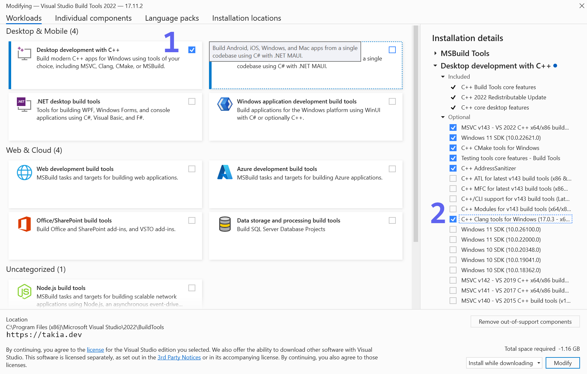
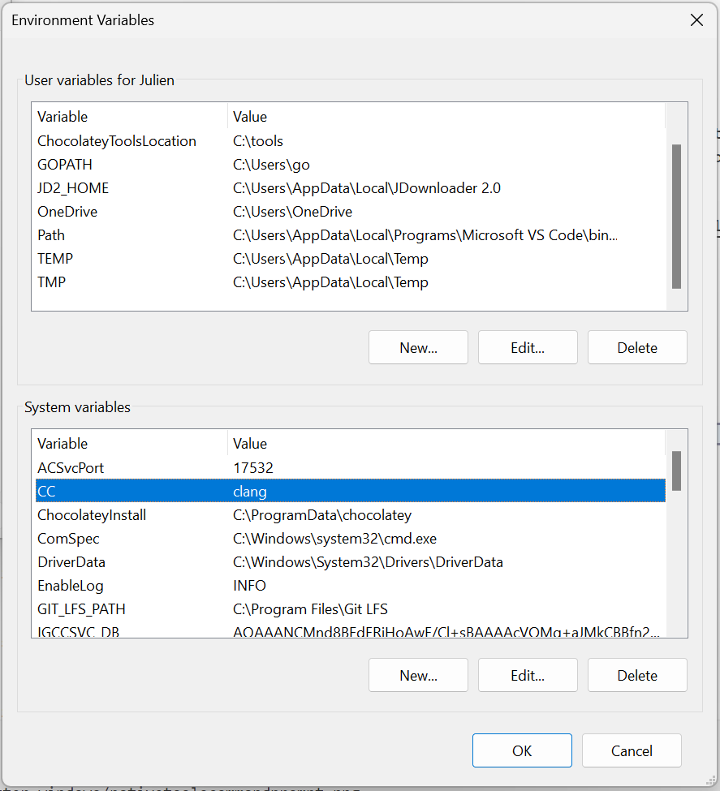

It was a real hassle to get [nvim-treesitter](https://github.com/nvim-treesitter/nvim-treesitter) to work on Windows 11. Here is how I got it working. - A working installation guide in 2024.

## Dependencies

The neovim treesitter plugin requires a working C/C++ compiler to install new language support. Even though the github documentation explains how to install several C/C++ compilers, only one worked for me: `clang` compiler installed through the Build Tools for Visual Studio 2022. Installing clang from the LLVM app did not link properly and using the `cl` compiler from the Build Tools did not work either.

First, [download the Build Tools for Visual Studio](https://visualstudio.microsoft.com/downloads/#build-tools-for-visual-studio-2022)

In the installation windows, be sure to check  **Desktop development with C++** on the left and **C++ clang tools for Windows** on the right as show in the picture below.



Then, update the system environment variables and set `CC = clang`.

 


## Setup steps

To avoid parsers conflicts, rename the following folder:

```
C:\Program Files\Neovim\lib\nvim\parser
```

To something else, for instance:

```
C:\Program Files\Neovim\lib\nvim\parser.sav
```

## Configure the terminal

To be able to compile the treesiter parsers, you need a working developper terminal. Here is how to configure powershell.

First, open or create the powershell user-profile file:

```
notepad.exe $HOME\Documents\PowerShell\Profile.ps1
```

And paste this code ([related stackoverflow thread](https://stackoverflow.com/questions/2124753/how-can-i-use-powershell-with-the-visual-studio-command-prompt)) inside:

```
$vsPath = &"${env:ProgramFiles(x86)}\Microsoft Visual Studio\Installer\vswhere.exe" -latest -products * -requires Microsoft.VisualStudio.Component.VC.Tools.x86.x64 -property installationpath

Write-Host "Microsoft Visual Studio path = '$vsPath'"

# Use module `Microsoft.VisualStudio.DevShell.dll`
Import-Module (Get-ChildItem $vsPath -Recurse -File -Filter Microsoft.VisualStudio.DevShell.dll).FullName

Enter-VsDevShell -VsInstallPath $vsPath -SkipAutomaticLocation -DevCmdArguments '-arch=x64'
```

Finally, restart your terminal and make sure you are running 64 bit powershell as follows:

```powershell
[Environment]::Is64BitProcess
```

This should respond `true`. If it doesn't look for the 64bit powershell executable on your machine.

## Install nvim-treesitter

Finally, install nvim-treesitter using you favorite package manager. The [nvim-treesitter github](https://github.com/nvim-treesitter/nvim-treesitter) has some installation instructions. Here is my `init.lua` file:

```lua
require('pckr').add{
  {'nvim-treesitter/nvim-treesitter',
    tag = "v0.9.2",
    run = function()
        require ('nvim-treesitter.install').compilers = { "clang" }
        local ts_update = require('nvim-treesitter.install').update({ with_sync = true })
        ts_update()
    end,
    config = function ()
      require ('nvim-treesitter.install').compilers = { "clang" } 
      local configs = require("nvim-treesitter.configs")
      configs.setup({
        ensure_installed = { 
            "go", "gomod",
            "python", 
            "c", "lua", "vim", "vimdoc", "query", "markdown", "markdown_inline"},
          sync_install = false,
          highlight = { enable = true },
          indent = { enable = false },  

          -- Enable vim-matchup plugin integration with treesitter
          matchup = {
            enable = true,
            include_match_words = true,
            -- disable = { "c", "ruby" },
            -- [options]
          },
        })
    end,
  };
}
```

Hopefully, you can get it up and running too. Happy coding!